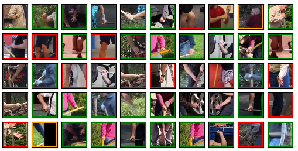

## Data collection and annotation steps

This page provides detailed instructions on how to collect and annotate new image/video data for improving the [contact recognizer](https://github.com/zongmianli/contact-recognizer).

### Prerequisites

- Install and configure [Openpose-video](https://github.com/zongmianli/Realtime_Multi-Person_Pose_Estimation) by following the instructions on the project page.
  ```terminal
  git clone https://github.com/zongmianli/Realtime_Multi-Person_Pose_Estimation ~/Openpose-video
  ```

- Create a local folder for saving all intermediate and final results.
In the following steps, We use the bash variable `${data}` to represent the absolute path to this folder.
  ```terminal
  mkdir -p ~/contact-recognizer/data
  data=$(echo ~/contact-recognizer/data)
  ```


### Creating an image folder

1. Collect still images and videos clips capturing person-environment contacts & interactions. 
Edit the raw data if necessary: for example, shorten long video clips to focus on interesting parts.
Mix the images and videos in a single gallery (called an *image folder*) created by running:
   ```terminal
   image_folder=more_images # specify name of the image folder
   mkdir -p ${data}/raw/${image_folder}
   ```
2. Run the following script to convert videos in `${image_folder}` to image sequences.
Skip this step if there are no videos in the image folder.
   ```terminal
   source create_data/replace_videos_with_frameimages.sh ${data}/raw/${image_folder}
   ```

3. Run the following script to assign index numbers to all images in `${image_folder}`.
This will create a `data_info.pkl` file in the image folder.
   ```terminal
   python create_data/create_data_info.py ${data}/raw/${image_folder} --image_types="png,jpg" --save_info
   ```

   **Note on step 3.**
   In the output `data_info.pkl`, we use the generic name *item* to unify the description of the two types of data: *single image* and *sequence of images* (from the same video).
   Each item in `${image_folder}` is assigned to a unique `item_id`.
   Each image, including single images and the frame images from a video, is assigned to a unique `image_id`.

   Given an `image_id`, it is easy to get the name of the image through `image_names`; if the image is extracted from a video, we can retrieve the item id and the location of the image through `image_to_itemframes` (see the table below).

   |    image_ids | image_names         | images_to_itemframes |
   | :----------: | :---------------:   | :------------------: |
   |            0 | video0/000000.png   | [0, 0]               |
   |            1 | video0/000001.png   | [0, 1]               |
   |            2 | video0/000002.png   | [0, 2]               |
   |            3 | blablaimage.jpg     | [1, 0]               |
   |            4 | my_video/000000.png | [2, 0]               |
   |            5 | my_video/000000.png | [2, 1]               |

   Conversely, given an `item_id`, it is easy to get the name of the item through `item_names`, the ID of the first image in the item through `items_to_images` and the number of images in the item through `item_lengths` (See the table below).


   |     item_ids | item_names      | items_to_images |    item_lengths |
   | :----------: | :-------------: | :-------------: | :-------------: |
   |            0 | video0          |               0 |               3 |
   |            1 | blablaimage.jpg |               3 |               1 |
   |            2 | my_video        |               4 |               2 |

   In the example shown in the two tables above, item 0 and item 2 are video items with 3 and 2 frames, respectively, while item 1 is a still image.
   These kind of mappings are useful in the later data annotation and joint image extraction steps.


### Locating person joints in the 2D images

The goal is achieved by applying a decent 2D human pose estimator to the image folder.
In our case we use Openpose-video.
To guarantee the quality of pose estimation, we need to resize the images that are too large or too small before applying Openpose-video.

1. Move the images in original size to the temporary directory `${data}/full_images/${image_folder}_temp`:
   ```terminal
   mkdir ${data}/full_images
   cp -r ${data}/raw/${image_folder} ${data}/full_images/${image_folder}_temp
   ```

2. Run Openpose-video on `${image_folder}_temp` to get the 2D joint locations.
The output joint 2D positions together with their visualization are saved in `${vis_j2d}/`.
   ```terminal
   cd ~/Openpose-video/testing/python
   img_dir=${data}/full_images/${image_folder}_temp
   vis_j2d=${data}/openpose/${image_folder}_temp
   path_j2d=${data}/openpose/${image_folder}_temp/Openpose-video.pkl
   python run_imagefolder.py ${img_dir} ${vis_j2d} ${path_j2d} --save-after-each-iteration
   ```

3. Resize the images in `${image_folder}_temp` such that the height of the main human subject in each image is about 150 pixels.
This is down using the following script.
   ```terminal
   save_dir=${data}/full_images/${image_folder}
   python create_data/resize_images.py ${img_dir} ${save_dir} ${path_j2d} --width_limits=300,1500
   ```
   Specifically, the script first computes human bounding boxes based on the 2D joint locations, and then resizes the images according to the target human size.
For video items it applies a single bounding box to all frames.
The output resized images are saved in `${data}/full_images/${image_folder}`.


4. Run Openpose-video on `${data}/full_images/${image_folder}` to get the final 2D joint locations:
   ```terminal
   cd ~/Openpose-video/testing/python
   img_dir=${data}/full_images/${image_folder}
   vis_j2d=${data}/openpose/${image_folder}
   path_j2d=${data}/openpose/${image_folder}/Openpose-video.pkl
   python run_imagefolder.py ${img_dir} ${vis_j2d} ${path_j2d} --save-after-each-iteration
   cp ${path_j2d} ${data}/full_images/${image_folder}/Openpose-video.pkl
   ```
   Alternatively, if Openpose-video works well for the images in original size, you can choose to scale previous Openpose-video outputs to save time and energy.
   ```terminal
   path_datainfo=${data}/full_images/${image_folder}/data_info.pkl
   path_j2d=${data}/openpose/${image_folder}_temp_/Openpose-video.pkl
   path_resizeinfo=${data}/full_images/${image_folder}/resize_info.pkl
   save_path=${data}/full_images/${image_folder}/Openpose-video.pkl
   python create_data/resize_joint_2d_positions.py ${path_datainfo} ${path_j2d} ${path_resizeinfo} ${save_path}
   ```

### Annotating joint contact states

This is done with the help of the annotation tool:
```terminal
python create_data/annotation_tool.py ${img_dir} ${vis_j2d} ${path_j2d}
```
Please refer to [create_data/annotation_tool.py](https://github.com/zongmianli/contact-recognizer/blob/master/create_data/annotation_tool.py) for detailed usage.

In brief, for each joint we type two labels as a command, for example by typing `14` and press `Enter` we annotate that the current joint is in contact and the Openpose estimation is correct.
Type `wq` and press `Enter` to write the annotated labels to file and quit.
This command will save the annotation to `${data}/full_images/${image_folder}/contact_states_annotation.pkl`.

|  labels | contact states       | Openpose quality                            |
| :-----: | :------------------- | :------------------------------------------ |
|       1 | joint in contact     | -                                           |
|       2 | joint not in contact | -                                           |
|       3 | occluded joint       | -                                           |
|       4 | -                    | joint detected and correct                  |
|       5 | -                    | joint detected but incorrect: flipped limbs |
|       6 | -                    | joint detected but incorrect: other cases   |
|       7 | -                    | undetected joint                            |


### Cropping joint images

This is the final step of the data creation process.
At this stage, we are supposed to have created:
- The directory `${data}/full_images/${image_folder}` containing (resized) images and sequences of images.
- 2D joint positions in `${data}/openpose/${image_folder}/Openpose-video.pkl`.
- Annotated contact states in `${data}/full_images/${image_folder}/contact_states_annotation.pkl`.

We provide code cropping image patches around person joints in [create_data/create_data.py](https://github.com/zongmianli/contact-recognizer/blob/master/create_data/create_data.py).
Update the variables `image_folders`, `save_folder`, `crop_sizes` and `joint_names` in the following sample script and run:
```terminal
img_dir=${data}/full_images/${image_folder}
save_dir=${data}/joint_images/${image_folder}
crop_sizes=100,120 # crop sizes split by comma
joint_names=hands,soles,toes # joint types split by comma

python create_data/create_data.py ${img_dir} ${save_dir} --crop-sizes=${crop_sizes} --joint-names=${joint_names}
```

The main steps implemented in `create_data/create_data.py` are:
- Run a several of preprocessing steps:
  1. Load data info, contact states and joint 2D locations. 
  2. Count the number of undetect joints (`[0,0,0,0,0,0,1]` rows in `contact_states`), while skipping the items with unlabeled data (`[0,0,0,0,0,0,0]` rows in `contact_states`). See `count_undetected_joints()` for implementation.
  3. Initialize the `*.h5` data files.
  4. Loop over `item_names` to extract joint images of each item image. 
- Loop over the image index numbers saved in `data_info.pkl`.
  - For each image, loop over all the joints of interest.
    - For each joint, decide whether or not to crop the joint patch.
      For example, you will cannot crop the joint if it is not detected by Openpose (label 7).
    - For each cropped joint, create the corresponding label used for training. 
      The label is generated from the annotated labels, using a perferred policy.
      For example, for creating a two-class classification problem, you will want to merge the *not in contact* and the *occluded* joints, and ignore incorrectly detected joints due to flipped limbs.
  - Specifically, a list named `image_ids` is created for saving the image index numbers where the joint is cropped and labelled. 
This will allow you to track back the original item and video frame for visualizing the results.
- Finally, for each type of joint, save `joint_patches`, `labels` and `image_ids` in HDF5 format to `${data}/joint_patches/<image_folder>_<joint_name>_<patch_size>.h5`.

### (Optional) Visualizing joint images

An additional verification step is to sample a set of joints and compare the cropped joint images with the annotated contact states.
To do this, update the paths and parameters at the end of [contact_dataset.py](https://github.com/zongmianli/contact-recognizer/blob/master/contact_dataset.py) and run:
```terminal
python contact_dataset.py
```
The script outputs a grid of joint images with different margin colors indicating contact states: green for *joint in contact*, red for *joint not in contact*, orange for *occluded joint*.

An example output is shown below:


